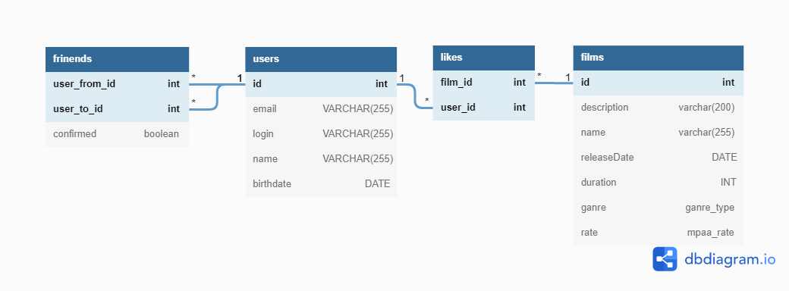

# java-filmorate
### Модель базы данных для приложения  

На схеме представлена модель базы данных для приложения Filmorate



## Запросы в базу данных, соответствующие методам контроллеров  
---
### users
<details><summary>GET /users</summary><p> 
```SQL
SELECT * FROM users;
```
</p></details>
<details><summary>GET /users/{id}</summary><p>
SELECT id, email, login, name, birthdate
FROM users  
WHERE id = {id};
</p></details>
#### GET /users/{id}/friends  
SELECT u.id, u.email, u.login, u.name, u.birthdate  
FROM users AS u
WHERE u.id IN (  
&emsp;SELECT f.user_to_id   
&emsp;FROM friends AS f  
&emsp;WHERE f.user_from_id = {id} AND f.confirmed = 'true')
UNION  
SELECT u.id, u.email, u.login, u.name, u.birthdate  
FROM users AS u
WHERE u.id IN (  
&emsp;SELECT f.user_from_id  
&emsp;FROM friends AS f  
&emsp;WHERE f.user_to_id = {id} AND f.confirmed = 'true');

#### GET /users/{id}/friends/common/{otherId}  
SELECT u.id, u.email, u.login, u.name, u.birthdate  
FROM users AS u
WHERE u.id IN (  
&emsp;SELECT f.user_to_id   
&emsp;FROM friends AS f  
&emsp;WHERE f.user_from_id = {id} AND f.confirmed = 'true' AND f.user_to_id != {otherId})   
OR IN (  
&emsp;SELECT f.user_from_id  
&emsp;FROM friends AS f  
&emsp;WHERE f.user_to_id = {id} AND f.confirmed = 'true' AND f.user_from_id != {otherId})
INTERSECT
SELECT u.id, u.email, u.login, u.name, u.birthdate  
FROM users AS u
WHERE u.id IN (  
&emsp;SELECT f.user_to_id   
&emsp;FROM friends AS f  
&emsp;WHERE f.user_from_id = {otherId} AND f.confirmed = 'true' AND f.user_to_id != {id})   
OR IN (  
&emsp;SELECT f.user_from_id  
&emsp;FROM friends AS f  
&emsp;WHERE f.user_to_id = {otherId} AND f.confirmed = 'true' AND f.user_from_id != {id});

#### POST /users
INSERT INTO users (email,login,name,birthdate)  
VALUES ('123@ya.ru','test_user','test user name',TO_DATE('01022019','MMDDYYYY'))
RETURNING id;
#### PUT /users
UPDATE users  
SET email = '123@ya.ru', login = 'test_user', name = 'test user name', birthdate = TO_DATE('01022019','MMDDYYYY')  
WHERE id = 'id';
#### PUT /users/{id}/friends/{friendId}
INSERT INTO friends (user_from_id,user_to_id)
VALUES ({id},{friendId});
#### DELETE /users/{id}/friends/{friendId}
DELETE FROM friends    
WHERE (user_from_id = id AND user_to_id = friendId) OR (user_from_id = friendId AND user_to_id = id);
#### DELETE /users/{id}
DELETE FROM users  
WHERE id = {id}