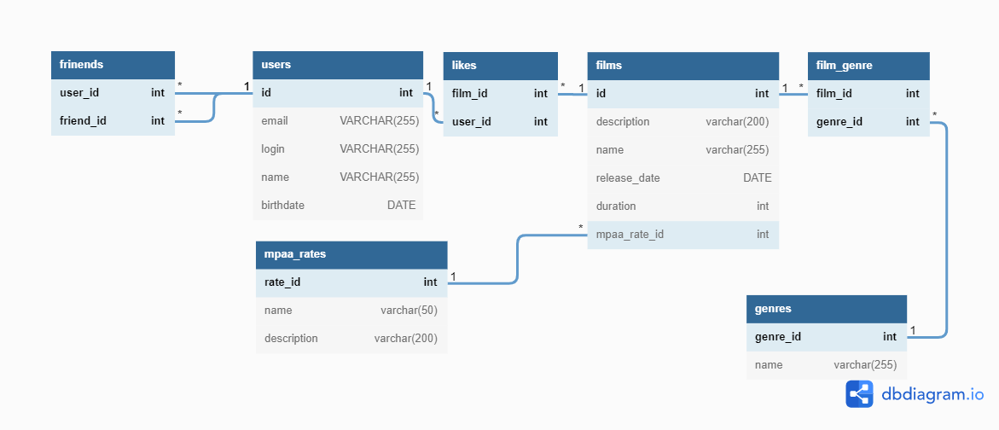

# java-filmorate
### Модель базы данных для приложения  

На схеме представлена модель базы данных для приложения Filmorate


  
## Запросы в базу данных, соответствующие методам контроллеров  

---
### users
<details>
  <summary>GET /users</summary>
  
```sql
    SELECT * FROM users;
```
</details>  
<details>
  <summary>GET /users/{id}</summary>
    
```sql
    SELECT *  
    FROM users  
    WHERE id = {id};
```
</details>  
<details>
  <summary>GET /users/{id}/friends</summary>
  
```sql
    SELECT u.id, u.email, u.login, u.name, u.birthdate  
    FROM users AS u
    WHERE u.id IN (  
        SELECT f.user_to_id   
        FROM friends AS f  
        WHERE f.user_from_id = {id} AND f.confirmed = 'true')
    UNION  
    SELECT u.id, u.email, u.login, u.name, u.birthdate  
    FROM users AS u
    WHERE u.id IN (  
        SELECT f.user_from_id  
        FROM friends AS f  
        WHERE f.user_to_id = {id} AND f.confirmed = 'true');  
```
</details>  
<details>
  <summary>GET /users/{id}/friends/common/{otherId}</summary>
  
```sql
    SELECT u.id, u.email, u.login, u.name, u.birthdate  
    FROM users AS u
    WHERE u.id IN (  
        SELECT f.user_to_id   
        FROM friends AS f  
        WHERE f.user_from_id = {id} AND f.confirmed = 'true' AND f.user_to_id != {otherId})   
    OR IN (  
        SELECT f.user_from_id  
        FROM friends AS f  
        WHERE f.user_to_id = {id} AND f.confirmed = 'true' AND f.user_from_id != {otherId})
    INTERSECT
    SELECT u.id, u.email, u.login, u.name, u.birthdate  
    FROM users AS u
    WHERE u.id IN (  
        SELECT f.user_to_id   
        FROM friends AS f  
        WHERE f.user_from_id = {otherId} AND f.confirmed = 'true' AND f.user_to_id != {id})   
    OR IN (  
        SELECT f.user_from_id  
        FROM friends AS f  
        WHERE f.user_to_id = {otherId} AND f.confirmed = 'true' AND f.user_from_id != {id});
```
</details>
<details>
  <summary>POST /users</summary>
  
```sql
    INSERT INTO users (email,login,name,birthdate)  
    VALUES ('123@ya.ru','test_user','test user name',TO_DATE('01022019','MMDDYYYY'))
    RETURNING id;
```
</details>
<details>
  <summary>PUT /users</summary>
  
```sql
    UPDATE users  
    SET email = '123@ya.ru', login = 'test_user', name = 'test user name', birthdate = TO_DATE('01022019','MMDDYYYY')  
    WHERE id = 'id';
```
</details>
<details>
  <summary>PUT /users/{id}/friends/{friendId}</summary>
  
```sql
    INSERT INTO friends (user_from_id,user_to_id)
    VALUES ({id},{friendId});
```
</details>
<details>
  <summary>DELETE /users/{id}/friends/{friendId}</summary>
  
```sql
    DELETE FROM friends    
    WHERE (user_from_id = {id} AND user_to_id = {friendId}) OR (user_from_id = {friendId} AND user_to_id = {id});
```
</details>
<details>
  <summary>DELETE /users/{id}</summary>
  
```sql
    DELETE FROM users  
    WHERE id = {id};
```
</details>

***  
### films
<details>
    <summary>GET /films</summary>
  
```sql
    SELECT f.id, f.description,f.name, f.releaseDate, f.durarion, r.name as mpaaRate 
    FROM films AS f 
    LEFT JOIN mpaaRates AS r ON f.rate_id = r.rate_id;
```
</details>
<details>
    <summary>GET /films/{id}</summary>
  
```sql
    SELECT f.id, f.description,f.name, f.releaseDate, f.durarion, r.name as mpaaRate
    FROM films AS f 
    LEFT JOIN mpaaRates AS r ON f.rate_id = r.rate_id
    WHERE id = {id};
```
</details>
<details>
    <summary>GET /films/popular?count=10</summary>
  
```sql
    SELECT f.name, f.releaseDate, COUNT(l.user_id) as userRating, r.name as mpaaRate
    FROM films AS f
    LEFT JOIN likes AS l ON f.id = l.film_id
    LEFT JOIN mpaaRates AS r ON f.rate_id = r.rate_id
    GROUP BY f.id
    ORDER BY COUNT(l.user_id) DESC
    limit {count};
```
</details>
<details>
    <summary>POST /films</summary>
  
```sql
    INSERT INTO films (description,name, releaseDate,duration,rate_id)
    VALUES ('desc','Awesome film', TO_DATE('01022019','MMDDYYYY'),120,2)
    RETURNING id;
```
</details>
<details>
    <summary>PUT /films</summary>
  
```sql
    UPDATE films
    SET description = 'desc',name = 'Awesome film', releaseDate = TO_DATE('01022019','MMDDYYYY'),
        duration = 120,rate = 2
    WHERE id = 'id';
```
</details>
<details>
    <summary>PUT /films/{id}/like/{userId}</summary>
  
```sql
    INSERT INTO likes (film_id, user_id)
    VALUES ({id}, {userId});
```
</details>
<details>
    <summary>DELETE /films/{id}</summary>
  
```sql
    DELETE FROM films
    WHERE id = {id};
```
</details>
<details>
    <summary>DELETE /films/{id}/like/{userId}</summary>
  
```sql
    DELETE FROM likes
    WHERE film_id = {id} AND user_id = {userId};
```
</details>
<details>
    <summary>add genre</summary>
  
```sql
    INSERT INTO film_genre (film_id,genre_id)
    VALUES (5,2);
```
</details>


***
